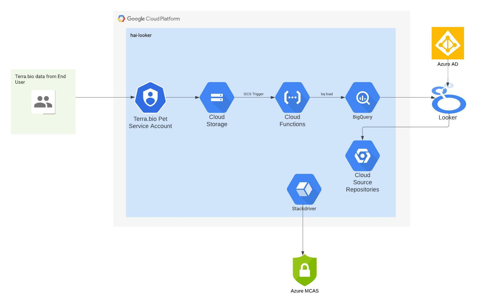

# hospital_acquired_infections_dashboard

This repo contains the LookML code used in the dashboard configuration for the Healthcare Associated Infections initiative. This README will contain information regarding the different LookML folders/files as well as the high level overview of the GCP architecture for this project.

## High Level Architecture

In the hai-looker project under the cdph.tabordasolutions.io organization, We have a data pipeline configured that allows genetic sequencing data to flow from Terra.bio to a GCS bucket (hai-terra-upload). The Terra.bio end user authenticates to GCP via a pet service account and Theiagen has set up their pipeline to export raw .json files from Terra.bio every 15 minutes. Every time a new file is dropped into the bucket, this triggers a Cloud Function (gcs-to-bq) via a GCS trigger on finalizing/creating file in the selected bucket. The code logic then takes the raw .json file and runs a bq load job that truncates the previous BigQuery table (hai-looker.cdph_hai_combined.hai_master) with the new data from the raw file. A view (hai-looker.cdph_hai_combined.amr_split_flat) was created from the master table that parses the necessary fields based on their business use case and the nature of the underlying data. From the BigQuery view, this data is queried by Looker via a BigQuery connection to be used for their dashboard visualizations and scheduled reports. End users authenticate to Looker via the Azure AD SAML connection configuration. LookML code is connected to the  hospital_acquired_infections_dashboard Cloud Source Repository.

## LookML Folders/Files

### maps

The maps folder contains the california_counties_topo.json file. This defines the county shapes used in the map visualization on the dashboard. This file is referenced in the model file's map_layer definition and uses "NAME" as the property_key value.

### models

The model folder contains the hospital_acquired_infections_dashboard.model file. This model file defines the connection name, views included in the Explore menu, datagroups, persist_with (references which datagroup the model persists with), explores and map layer.

### views

This folder contains all of the view files. The view file used for the dashboard visualizations is amr_split_flat.view. This file contains the view name, SQL table reference as well as the dimensions, measures, and custom filter definitions.
